# Scripts, data and images used for the 2026 report

This page shows images and links to the data that was used to produce graphs in
the manuscript entitled "Time Evolution Simulation of a Hydrogen Atom Using Full
Quantum Circuits" authored by Hideo Takahashi et.al.

The section and figure numbers are those within the manuscript.

To reproduce the data, environment setup is required.  The data was generated on
a PC with a GPU with Ubuntu installed natively. Setup procedures are described
in [../../README.md](../../README.md)

All data and image files shown in this page is archived under a subdirectory
named report2026_data.  Howeber, when the scripts are run the data will be
generated under a subdirectory named onedrive.lnk.

## Section 2.1.3

### Figure 1. Example of the 1D model wave function $\Psi^{\mathrm{1D}}_1$
Image

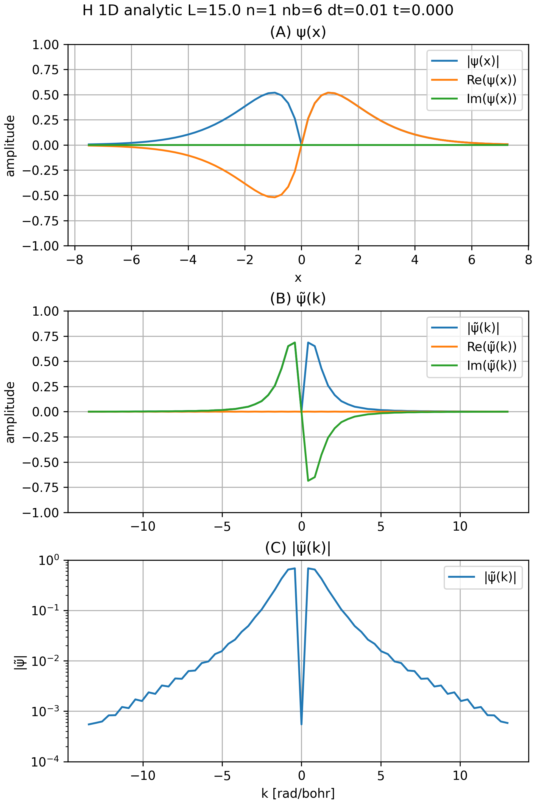

Data files

- [real space state vector data](analytic1D/1D_6b_signed/N1_L15.0_X0.0_WM32/dt0.01/0n.20e/frames/state_vector_0.000_q.csv)
- [momentum space state vector data](analytic1D/1D_6b_signed/N1_L15.0_X0.0_WM32/dt0.01/0n.20e/frames/state_vector_0.000_p.csv)

Script to produce data and image

```bash
python time_evo_analytic_1Dh1.py --bits 6 --length 15 --x0 0 --delta-t 0.010 --interval-time 0.2 --total-time 0.01 --window-radius 32 --dpi 300
```

### Figures 2. and 3. Wave functions $\Psi^{\mathrm{2D}}$
Images

quantum numbers n=0, m=0

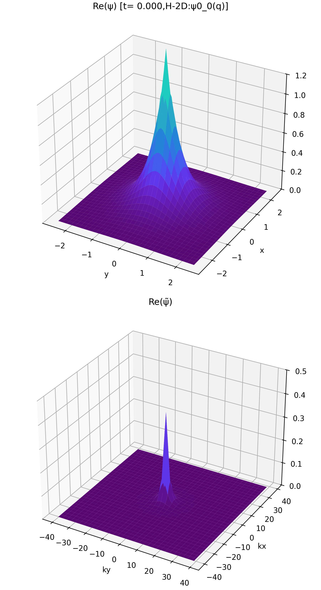

n=1, m=0

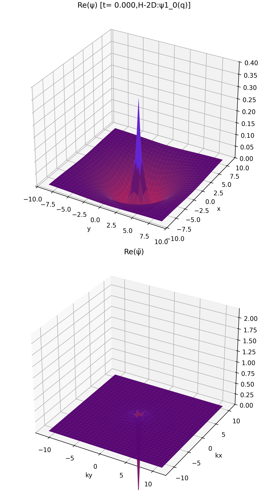

n=1, m=1

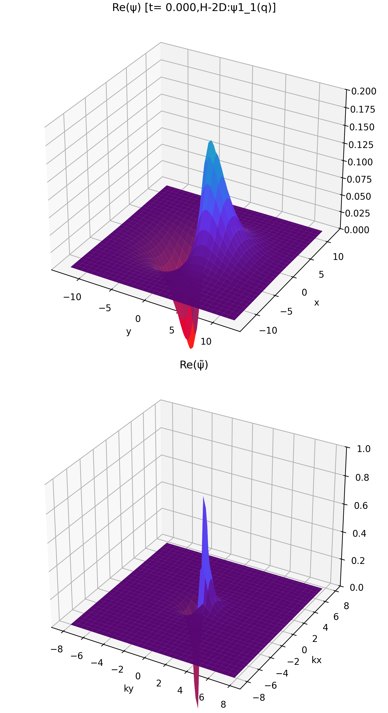

Data files

- n=0, m=0
  - [state vector in real space](classic2D/n0_m0_TO2_r0lim_0.250/6b_L5.0_T4.0_iT0.2_dt0.001/frames/00.000.q.csv)
  - [state vector in momentum space](classic2D/n0_m0_TO2_r0lim_0.250/6b_L5.0_T4.0_iT0.2_dt0.001/frames/00.000.q.csv)
- n=1, m=0
  - [state vector in real space](classic2D/n1_m0_TO2_r0lim_0.250/6b_L18.0_T30.0_iT0.5_dt0.01/frames/00.000.q.csv)
  - [state vector in momentum space](classic2D/n1_m0_TO2_r0lim_0.250/6b_L18.0_T30.0_iT0.5_dt0.01/frames/00.000.p.csv)
- n=1, m=1
  - [state vector in real space](classic2D/n1_m1_TO2_r0lim_0.250/6b_L25.0_T30.0_iT0.5_dt0.01/frames/00.000.q.csv)
  - [state vector in momentum space](classic2D/n1_m1_TO2_r0lim_0.250/6b_L25.0_T30.0_iT0.5_dt0.01/frames/00.000.p.csv)

Scripts

To generate the data
```bash
./run_evo_classic_2Dh1_0_0.sh
./run_evo_classic_2Dh1_1_0.sh
./run_evo_classic_2Dh1_1_1.sh
```

To draw the specific images from the data
```bash
python draw_classic2d_frame.py --bits 6 --qnum-n 0 --qnum-m 0 --length 5 --psixmax 1.2 --psikmax 0.5 --delta-t 0.001 --interval-time 0.2 --total-time 4.0 --plot-type 3d-qp --time 0.0 --dpi 300
python draw_classic2d_frame.py --bits 6 --qnum-n 1 --qnum-m 0 --length 18 --psixmax 0.4 --psikmax 2.2 --delta-t 0.01 --interval-time 0.5 --total-time 30 --plot-type 3d-qp --time 0.0 --dpi 300
python draw_classic2d_frame.py --bits 6 --qnum-n 1 --qnum-m 1 --length 25 --psixmax 0.2 --psikmax 1.0 --delta-t 0.01 --interval-time 0.5 --total-time 30 --plot-type 3d-qp --time 0.0 --dpi 300
```

## Section 3.1.3
### Figure 9. Circuit size

Image

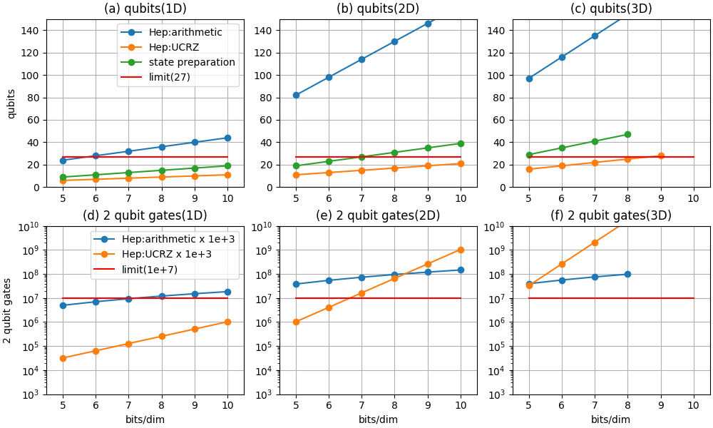

Data

- [Gate counts for arithmetic circuits for nb=5..8, dim=1..3](count_gates/hamiltonian-gatecount-arith-elec-potential-d1-3-n5-8.csv)
- [Gate counts for arithmetic circuits for nb=9..10, dim=1..2](count_gates/hamiltonian-gatecount-arith-elec-potential-d1-2-n9-10.csv)
- [Gate counts for ucrz circuits for nb=5..7, dim=1..3](count_gates/hamiltonian-gatecount-ucrz-d1-3-n5-7.csv)
- [Gate counts for ucrz circuits for nb=8..10, dim=1..2](count_gates/hamiltonian-gatecount-ucrz-d1-2-n8-10.csv)
- [Gate counts for ucrz circuits for nb=8..9, dim=3](count_gates/hamiltonian-gatecount-ucrz-d3-3-n8-9.csv)
- [Gate counts for state preparation for nb=5..7, dim=1..3](count_gates/hamiltonian-gatecount-embed-d1-3-n5-7.csv)
- [Gate counts for state preparation for nb=8..10, dim=1..2](count_gates/hamiltonian-gatecount-embed-d1-2-n8-10.csv)
- [Gate counts for state preparation for nb=8, dim=3](count_gates/hamiltonian-gatecount-embed-d3-3-n8-8.csv)

Scripts

```bash
python count_gate_sizes.py
```

## Section 3.2.1 - 3.2.2
### Figures 10, 11 Changes in energy when varying $r_{\mathrm{eff}}$ in the approximated formula $H_{\mathrm{LA}}(r)$ and $H_{\mathrm{SC}}(r)$

Images

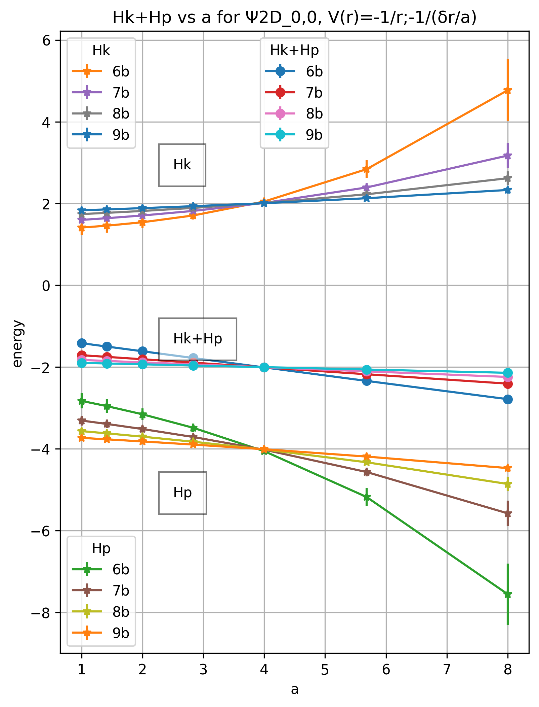

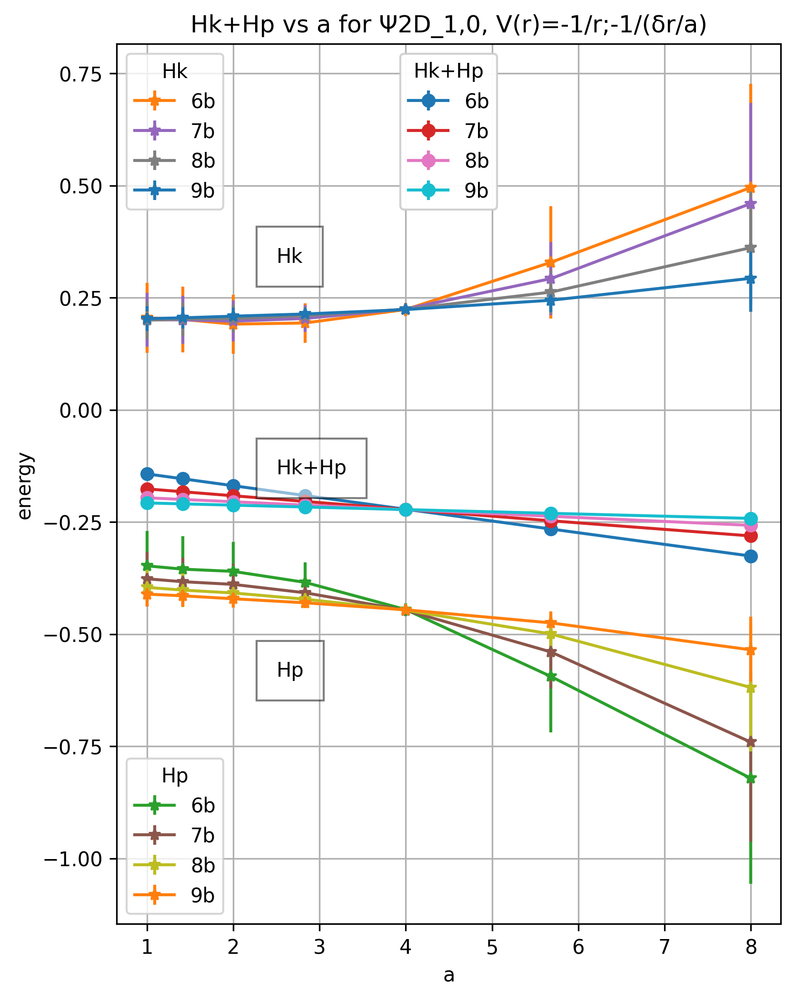

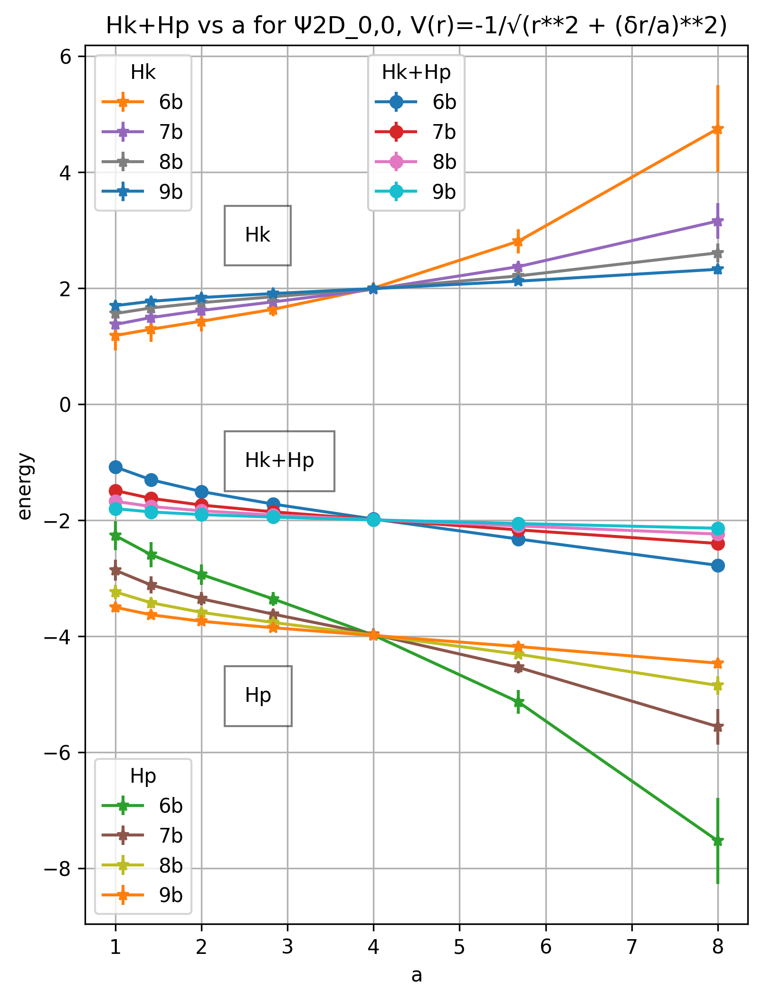

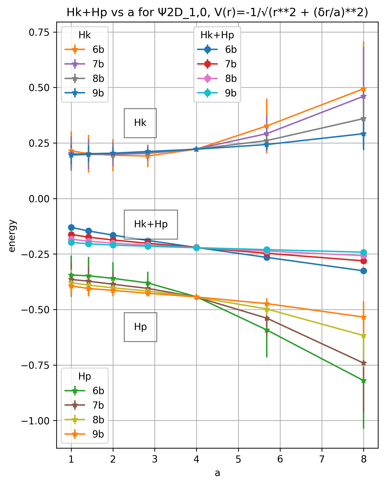

Data
- Local Average potential $H_{\mathrm{LA}}$ with $\Psi^{\mathrm{2D}}_{0,0}$
  - data for nb = 6
    - [a = 1](classic2D/n0_m0_TO2_r0lim_1.000/6b_L5.0_T4.0_iT0.2_dt0.001/energy_trace.csv)
    - [a = 2^0.5](classic2D/n0_m0_TO2_r0lim_0.707/6b_L5.0_T4.0_iT0.2_dt0.001/energy_trace.csv)
    - [a = 2^1](classic2D/n0_m0_TO2_r0lim_0.500/6b_L5.0_T4.0_iT0.2_dt0.001/energy_trace.csv)
    - [a = 2^1.5](classic2D/n0_m0_TO2_r0lim_0.353/6b_L5.0_T4.0_iT0.2_dt0.001/energy_trace.csv)
    - [a = 2^2](classic2D/n0_m0_TO2_r0lim_0.250/6b_L5.0_T4.0_iT0.2_dt0.001/energy_trace.csv)
    - [a = 2^2.5](classic2D/n0_m0_TO2_r0lim_0.176/6b_L5.0_T4.0_iT0.2_dt0.001/energy_trace.csv)
    - [a = 2^3](classic2D/n0_m0_TO2_r0lim_0.125/6b_L5.0_T4.0_iT0.2_dt0.001/energy_trace.csv)

  - data for nb = 7
    - [a = 1](classic2D/n0_m0_TO2_r0lim_1.000/7b_L5.0_T4.0_iT0.2_dt0.0001/energy_trace.csv)
    - [a = 2^0.5](classic2D/n0_m0_TO2_r0lim_0.707/7b_L5.0_T4.0_iT0.2_dt0.0001/energy_trace.csv)
    - [a = 2^1](classic2D/n0_m0_TO2_r0lim_0.500/7b_L5.0_T4.0_iT0.2_dt0.0001/energy_trace.csv)
    - [a = 2^1.5](classic2D/n0_m0_TO2_r0lim_0.353/7b_L5.0_T4.0_iT0.2_dt0.0001/energy_trace.csv)
    - [a = 2^2](classic2D/n0_m0_TO2_r0lim_0.250/7b_L5.0_T4.0_iT0.2_dt0.0001/energy_trace.csv)
    - [a = 2^2.5](classic2D/n0_m0_TO2_r0lim_0.176/7b_L5.0_T4.0_iT0.2_dt0.0001/energy_trace.csv)
    - [a = 2^3](classic2D/n0_m0_TO2_r0lim_0.125/7b_L5.0_T4.0_iT0.2_dt0.0001/energy_trace.csv)
  - data for nb = 8
    - [a = 1](classic2D/n0_m0_TO2_r0lim_1.000/8b_L6.0_T4.0_iT0.2_dt0.0001/energy_trace.csv)
    - [a = 2^0.5](classic2D/n0_m0_TO2_r0lim_0.707/8b_L6.0_T4.0_iT0.2_dt0.0001/energy_trace.csv)
    - [a = 2^1](classic2D/n0_m0_TO2_r0lim_0.500/8b_L6.0_T4.0_iT0.2_dt0.0001/energy_trace.csv)
    - [a = 2^1.5](classic2D/n0_m0_TO2_r0lim_0.353/8b_L6.0_T4.0_iT0.2_dt0.0001/energy_trace.csv)
    - [a = 2^2](classic2D/n0_m0_TO2_r0lim_0.250/8b_L6.0_T4.0_iT0.2_dt0.0001/energy_trace.csv)
    - [a = 2^2.5](classic2D/n0_m0_TO2_r0lim_0.176/8b_L6.0_T4.0_iT0.2_dt0.0001/energy_trace.csv)
    - [a = 2^3](classic2D/n0_m0_TO2_r0lim_0.125/8b_L6.0_T4.0_iT0.2_dt0.0001/energy_trace.csv)
  - data for nb = 9
    - [a = 1](classic2D/n0_m0_TO2_r0lim_1.000/9b_L7.0_T4.0_iT0.2_dt5e-05/energy_trace.csv)
    - [a = 2^0.5](classic2D/n0_m0_TO2_r0lim_0.707/9b_L7.0_T4.0_iT0.2_dt5e-05/energy_trace.csv)
    - [a = 2^1](classic2D/n0_m0_TO2_r0lim_0.500/9b_L7.0_T4.0_iT0.2_dt5e-05/energy_trace.csv)
    - [a = 2^1.5](classic2D/n0_m0_TO2_r0lim_0.353/9b_L7.0_T4.0_iT0.2_dt5e-05/energy_trace.csv)
    - [a = 2^2](classic2D/n0_m0_TO2_r0lim_0.250/9b_L7.0_T4.0_iT0.2_dt5e-05/energy_trace.csv)
    - [a = 2^2.5](classic2D/n0_m0_TO2_r0lim_0.176/9b_L7.0_T4.0_iT0.2_dt5e-05/energy_trace.csv)
    - [a = 2^3](classic2D/n0_m0_TO2_r0lim_0.125/9b_L7.0_T4.0_iT0.2_dt5e-05/energy_trace.csv)
- Local Average potential $H_{\mathrm{LA}}$ with $\Psi^{\mathrm{2D}}_{1,0}$
  - data for nb = 6
    - [a = 1](classic2D/n1_m0_TO2_r0lim_1.000/6b_L18.0_T30.0_iT0.5_dt0.01/energy_trace.csv)
    - [a = 2^0.5](classic2D/n1_m0_TO2_r0lim_0.707/6b_L18.0_T30.0_iT0.5_dt0.01/energy_trace.csv)
    - [a = 2^1](classic2D/n1_m0_TO2_r0lim_0.500/6b_L18.0_T30.0_iT0.5_dt0.01/energy_trace.csv)
    - [a = 2^1.5](classic2D/n1_m0_TO2_r0lim_0.353/6b_L18.0_T30.0_iT0.5_dt0.01/energy_trace.csv)
    - [a = 2^2](classic2D/n1_m0_TO2_r0lim_0.250/6b_L18.0_T30.0_iT0.5_dt0.01/energy_trace.csv)
    - [a = 2^2.5](classic2D/n1_m0_TO2_r0lim_0.176/6b_L18.0_T30.0_iT0.5_dt0.01/energy_trace.csv)
    - [a = 2^3](classic2D/n1_m0_TO2_r0lim_0.125/6b_L18.0_T30.0_iT0.5_dt0.01/energy_trace.csv)
  - data for nb = 7
    - [a = 1](classic2D/n1_m0_TO2_r0lim_1.000/7b_L21.0_T30.0_iT0.5_dt0.005/energy_trace.csv)
    - [a = 2^0.5](classic2D/n1_m0_TO2_r0lim_0.707/7b_L21.0_T30.0_iT0.5_dt0.005/energy_trace.csv)
    - [a = 2^1](classic2D/n1_m0_TO2_r0lim_0.500/7b_L21.0_T30.0_iT0.5_dt0.005/energy_trace.csv)
    - [a = 2^1.5](classic2D/n1_m0_TO2_r0lim_0.353/7b_L21.0_T30.0_iT0.5_dt0.005/energy_trace.csv)
    - [a = 2^2](classic2D/n1_m0_TO2_r0lim_0.250/7b_L21.0_T30.0_iT0.5_dt0.005/energy_trace.csv)
    - [a = 2^2.5](classic2D/n1_m0_TO2_r0lim_0.176/7b_L21.0_T30.0_iT0.5_dt0.005/energy_trace.csv)
    - [a = 2^3](classic2D/n1_m0_TO2_r0lim_0.125/7b_L21.0_T30.0_iT0.5_dt0.005/energy_trace.csv)
  - data for nb = 8
    - [a = 1](classic2D/n1_m0_TO2_r0lim_1.000/8b_L24.0_T30.0_iT0.5_dt0.001/energy_trace.csv)
    - [a = 2^0.5](classic2D/n1_m0_TO2_r0lim_0.707/8b_L24.0_T30.0_iT0.5_dt0.001/energy_trace.csv)
    - [a = 2^1](classic2D/n1_m0_TO2_r0lim_0.500/8b_L24.0_T30.0_iT0.5_dt0.001/energy_trace.csv)
    - [a = 2^1.5](classic2D/n1_m0_TO2_r0lim_0.353/8b_L24.0_T30.0_iT0.5_dt0.001/energy_trace.csv)
    - [a = 2^2](classic2D/n1_m0_TO2_r0lim_0.250/8b_L24.0_T30.0_iT0.5_dt0.001/energy_trace.csv)
    - [a = 2^2.5](classic2D/n1_m0_TO2_r0lim_0.176/8b_L24.0_T30.0_iT0.5_dt0.001/energy_trace.csv)
    - [a = 2^3](classic2D/n1_m0_TO2_r0lim_0.125/8b_L24.0_T30.0_iT0.5_dt0.001/energy_trace.csv)
  - data for nb = 9
    - [a = 1](classic2D/n1_m0_TO2_r0lim_1.000/9b_L27.0_T30.0_iT0.5_dt0.0005/energy_trace.csv)
    - [a = 2^0.5](classic2D/n1_m0_TO2_r0lim_0.707/9b_L27.0_T30.0_iT0.5_dt0.0005/energy_trace.csv)
    - [a = 2^1](classic2D/n1_m0_TO2_r0lim_0.500/9b_L27.0_T30.0_iT0.5_dt0.0005/energy_trace.csv)
    - [a = 2^1.5](classic2D/n1_m0_TO2_r0lim_0.353/9b_L27.0_T30.0_iT0.5_dt0.0005/energy_trace.csv)
    - [a = 2^2](classic2D/n1_m0_TO2_r0lim_0.250/9b_L27.0_T30.0_iT0.5_dt0.0005/energy_trace.csv)
    - [a = 2^2.5](classic2D/n1_m0_TO2_r0lim_0.176/9b_L27.0_T30.0_iT0.5_dt0.0005/energy_trace.csv)
    - [a = 2^3](classic2D/n1_m0_TO2_r0lim_0.125/9b_L27.0_T30.0_iT0.5_dt0.0005/energy_trace.csv)
- Soft core potential $H_{\mathrm{SC}}$ with $\Psi^{\mathrm{2D}}_{0,0}$
  - data for nb = 6
    - [a = 1](classic2D/n0_m0_TO2_rofs_1.000/6b_L5.0_T4.0_iT0.2_dt0.001/energy_trace.csv)
    - [a = 2^0.5](classic2D/n0_m0_TO2_rofs_0.707/6b_L5.0_T4.0_iT0.2_dt0.001/energy_trace.csv)
    - [a = 2^1](classic2D/n0_m0_TO2_rofs_0.500/6b_L5.0_T4.0_iT0.2_dt0.001/energy_trace.csv)
    - [a = 2^1.5](classic2D/n0_m0_TO2_rofs_0.353/6b_L5.0_T4.0_iT0.2_dt0.001/energy_trace.csv)
    - [a = 2^2](classic2D/n0_m0_TO2_rofs_0.250/6b_L5.0_T4.0_iT0.2_dt0.001/energy_trace.csv)
    - [a = 2^2.5](classic2D/n0_m0_TO2_rofs_0.176/6b_L5.0_T4.0_iT0.2_dt0.001/energy_trace.csv)
    - [a = 2^3](classic2D/n0_m0_TO2_rofs_0.125/6b_L5.0_T4.0_iT0.2_dt0.001/energy_trace.csv)
  - data for nb = 7
    - [a = 1](classic2D/n0_m0_TO2_rofs_1.000/7b_L5.0_T4.0_iT0.2_dt0.0001/energy_trace.csv)
    - [a = 2^0.5](classic2D/n0_m0_TO2_rofs_0.707/7b_L5.0_T4.0_iT0.2_dt0.0001/energy_trace.csv)
    - [a = 2^1](classic2D/n0_m0_TO2_rofs_0.500/7b_L5.0_T4.0_iT0.2_dt0.0001/energy_trace.csv)
    - [a = 2^1.5](classic2D/n0_m0_TO2_rofs_0.353/7b_L5.0_T4.0_iT0.2_dt0.0001/energy_trace.csv)
    - [a = 2^2](classic2D/n0_m0_TO2_rofs_0.250/7b_L5.0_T4.0_iT0.2_dt0.0001/energy_trace.csv)
    - [a = 2^2.5](classic2D/n0_m0_TO2_rofs_0.176/7b_L5.0_T4.0_iT0.2_dt0.0001/energy_trace.csv)
    - [a = 2^3](classic2D/n0_m0_TO2_rofs_0.125/7b_L5.0_T4.0_iT0.2_dt0.0001/energy_trace.csv)
  - data for nb = 8
    - [a = 1](classic2D/n0_m0_TO2_rofs_1.000/8b_L6.0_T4.0_iT0.2_dt0.0001/energy_trace.csv)
    - [a = 2^0.5](classic2D/n0_m0_TO2_rofs_0.707/8b_L6.0_T4.0_iT0.2_dt0.0001/energy_trace.csv)
    - [a = 2^1](classic2D/n0_m0_TO2_rofs_0.500/8b_L6.0_T4.0_iT0.2_dt0.0001/energy_trace.csv)
    - [a = 2^1.5](classic2D/n0_m0_TO2_rofs_0.353/8b_L6.0_T4.0_iT0.2_dt0.0001/energy_trace.csv)
    - [a = 2^2](classic2D/n0_m0_TO2_rofs_0.250/8b_L6.0_T4.0_iT0.2_dt0.0001/energy_trace.csv)
    - [a = 2^2.5](classic2D/n0_m0_TO2_rofs_0.176/8b_L6.0_T4.0_iT0.2_dt0.0001/energy_trace.csv)
    - [a = 2^3](classic2D/n0_m0_TO2_rofs_0.125/8b_L6.0_T4.0_iT0.2_dt0.0001/energy_trace.csv)
  - data for nb = 9
    - [a = 1](classic2D/n0_m0_TO2_rofs_1.000/9b_L7.0_T4.0_iT0.2_dt5e-05/energy_trace.csv)
    - [a = 2^0.5](classic2D/n0_m0_TO2_rofs_0.707/9b_L7.0_T4.0_iT0.2_dt5e-05/energy_trace.csv)
    - [a = 2^1](classic2D/n0_m0_TO2_rofs_0.500/9b_L7.0_T4.0_iT0.2_dt5e-05/energy_trace.csv)
    - [a = 2^1.5](classic2D/n0_m0_TO2_rofs_0.353/9b_L7.0_T4.0_iT0.2_dt5e-05/energy_trace.csv)
    - [a = 2^2](classic2D/n0_m0_TO2_rofs_0.250/9b_L7.0_T4.0_iT0.2_dt5e-05/energy_trace.csv)
    - [a = 2^2.5](classic2D/n0_m0_TO2_rofs_0.176/9b_L7.0_T4.0_iT0.2_dt5e-05/energy_trace.csv)
    - [a = 2^3](classic2D/n0_m0_TO2_rofs_0.125/9b_L7.0_T4.0_iT0.2_dt5e-05/energy_trace.csv)
- Soft core potential $H_{\mathrm{SC}}$ with $\Psi^{\mathrm{2D}}_{1,0}$
  - data for nb = 6
    - [a = 1](classic2D/n1_m0_TO2_rofs_1.000/6b_L18.0_T30.0_iT0.5_dt0.01/energy_trace.csv)
    - [a = 2^0.5](classic2D/n1_m0_TO2_rofs_0.707/6b_L18.0_T30.0_iT0.5_dt0.01/energy_trace.csv)
    - [a = 2^1](classic2D/n1_m0_TO2_rofs_0.500/6b_L18.0_T30.0_iT0.5_dt0.01/energy_trace.csv)
    - [a = 2^1.5](classic2D/n1_m0_TO2_rofs_0.353/6b_L18.0_T30.0_iT0.5_dt0.01/energy_trace.csv)
    - [a = 2^2](classic2D/n1_m0_TO2_rofs_0.250/6b_L18.0_T30.0_iT0.5_dt0.01/energy_trace.csv)
    - [a = 2^2.5](classic2D/n1_m0_TO2_rofs_0.176/6b_L18.0_T30.0_iT0.5_dt0.01/energy_trace.csv)
    - [a = 2^3](classic2D/n1_m0_TO2_rofs_0.125/6b_L18.0_T30.0_iT0.5_dt0.01/energy_trace.csv)
  - data for nb = 7
    - [a = 1](classic2D/n1_m0_TO2_rofs_1.000/7b_L21.0_T30.0_iT0.5_dt0.005/energy_trace.csv)
    - [a = 2^0.5](classic2D/n1_m0_TO2_rofs_0.707/7b_L21.0_T30.0_iT0.5_dt0.005/energy_trace.csv)
    - [a = 2^1](classic2D/n1_m0_TO2_rofs_0.500/7b_L21.0_T30.0_iT0.5_dt0.005/energy_trace.csv)
    - [a = 2^1.5](classic2D/n1_m0_TO2_rofs_0.353/7b_L21.0_T30.0_iT0.5_dt0.005/energy_trace.csv)
    - [a = 2^2](classic2D/n1_m0_TO2_rofs_0.250/7b_L21.0_T30.0_iT0.5_dt0.005/energy_trace.csv)
    - [a = 2^2.5](classic2D/n1_m0_TO2_rofs_0.176/7b_L21.0_T30.0_iT0.5_dt0.005/energy_trace.csv)
    - [a = 2^3](classic2D/n1_m0_TO2_rofs_0.125/7b_L21.0_T30.0_iT0.5_dt0.005/energy_trace.csv)
  - data for nb = 8
    - [a = 1](classic2D/n1_m0_TO2_rofs_1.000/8b_L24.0_T30.0_iT0.5_dt0.001/energy_trace.csv)
    - [a = 2^0.5](classic2D/n1_m0_TO2_rofs_0.707/8b_L24.0_T30.0_iT0.5_dt0.001/energy_trace.csv)
    - [a = 2^1](classic2D/n1_m0_TO2_rofs_0.500/8b_L24.0_T30.0_iT0.5_dt0.001/energy_trace.csv)
    - [a = 2^1.5](classic2D/n1_m0_TO2_rofs_0.353/8b_L24.0_T30.0_iT0.5_dt0.001/energy_trace.csv)
    - [a = 2^2](classic2D/n1_m0_TO2_rofs_0.250/8b_L24.0_T30.0_iT0.5_dt0.001/energy_trace.csv)
    - [a = 2^2.5](classic2D/n1_m0_TO2_rofs_0.176/8b_L24.0_T30.0_iT0.5_dt0.001/energy_trace.csv)
    - [a = 2^3](classic2D/n1_m0_TO2_rofs_0.125/8b_L24.0_T30.0_iT0.5_dt0.001/energy_trace.csv)
  - data for nb = 9
    - [a = 1](classic2D/n1_m0_TO2_rofs_1.000/9b_L27.0_T30.0_iT0.5_dt0.0005/energy_trace.csv)
    - [a = 2^0.5](classic2D/n1_m0_TO2_rofs_0.707/9b_L27.0_T30.0_iT0.5_dt0.0005/energy_trace.csv)
    - [a = 2^1](classic2D/n1_m0_TO2_rofs_0.500/9b_L27.0_T30.0_iT0.5_dt0.0005/energy_trace.csv)
    - [a = 2^1.5](classic2D/n1_m0_TO2_rofs_0.353/9b_L27.0_T30.0_iT0.5_dt0.0005/energy_trace.csv)
    - [a = 2^2](classic2D/n1_m0_TO2_rofs_0.250/9b_L27.0_T30.0_iT0.5_dt0.0005/energy_trace.csv)
    - [a = 2^2.5](classic2D/n1_m0_TO2_rofs_0.176/9b_L27.0_T30.0_iT0.5_dt0.0005/energy_trace.csv)
    - [a = 2^3](classic2D/n1_m0_TO2_rofs_0.125/9b_L27.0_T30.0_iT0.5_dt0.0005/energy_trace.csv)

Scripts

To generate the time evolution data files

```bash
./run_evo_analytical_2Dh1_0_0.sh
./run_evo_analytical_2Dh1_1_0.sh
./run_evo_analytical_2Dh1_1_1.sh
./run_evo_classic_2Dh1_0_0.sh
./run_evo_classic_2Dh1_1_0.sh
./run_evo_classic_2Dh1_1_1.sh
```

To generate the energy comparison data files from the time evolution data files

```bash
./run_compare_energy_h2D.sh
```

To draw the images from energy comparison data files

```bash
python compare_energy_h2D_r0.py
```

## Section 3.3.1
### Figure 12. Relationship between $|S_{\mathrm{d}}-S_1|$ and $S_2$ at several $n_{\mathrm{b}}$

Images

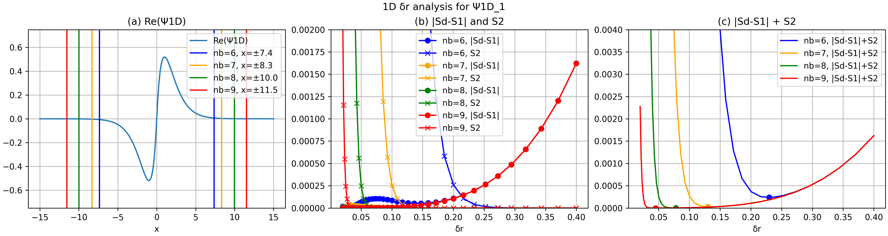
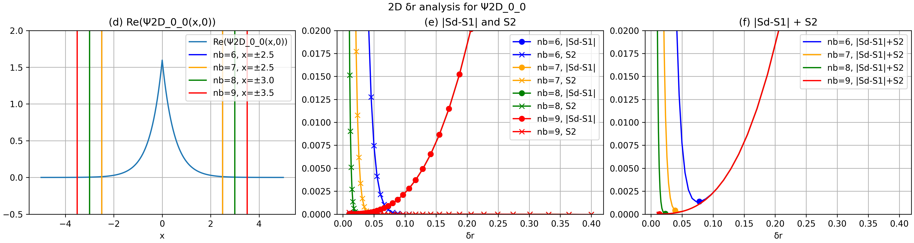
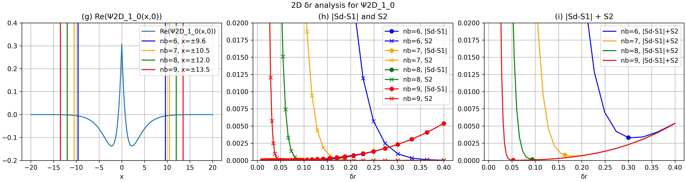

Data

- [Data for 1D, n=1](dq_tradeoff2/eval1d_dq.csv)
- [Data for 2D, n=0, m=0](dq_tradeoff2/eval2d_geom_0_0.csv)
- [Data for 2D, n=1, m=0](dq_tradeoff2/eval2d_geom_1_0.csv)

Scripts to generate the data and images

```bash
python draw_h1dq_tradeoff_1d.py
python draw_h1dq_tradeoff_2d.py
```

## Section 3.3.2
### Figures 13 and 14. The upper bound $B_N^{(\gamma)}$ and observed value $\xi_N^{(\gamma)}$ of the error with respect to the number of divisions $n_{\mathrm{T}}$ at the time evolution period $t=1.0$

Images

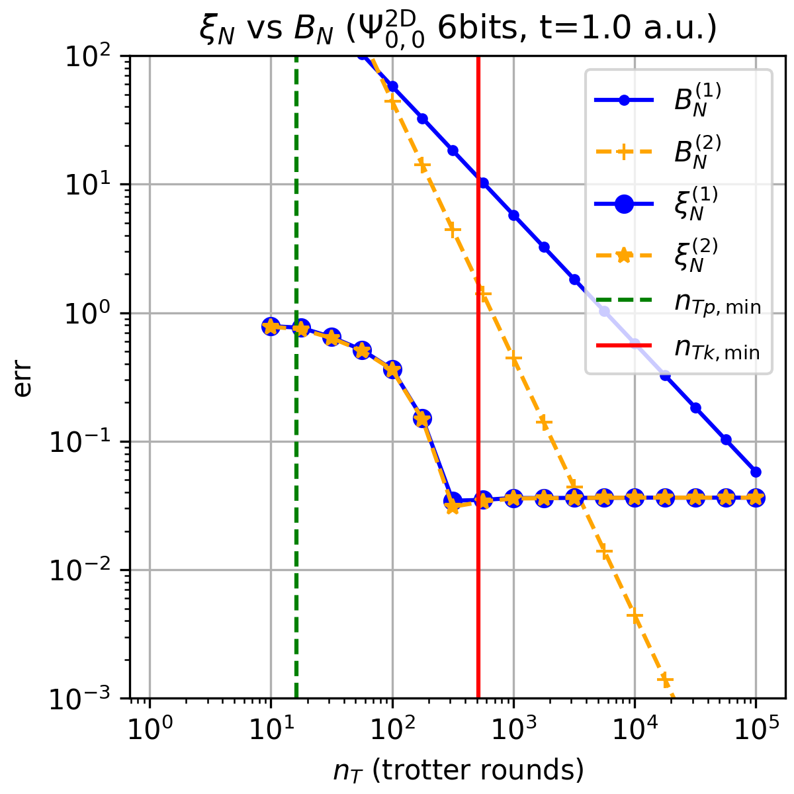
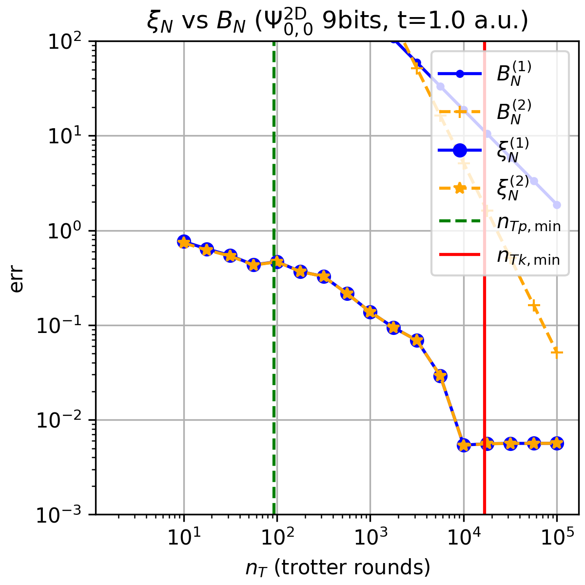
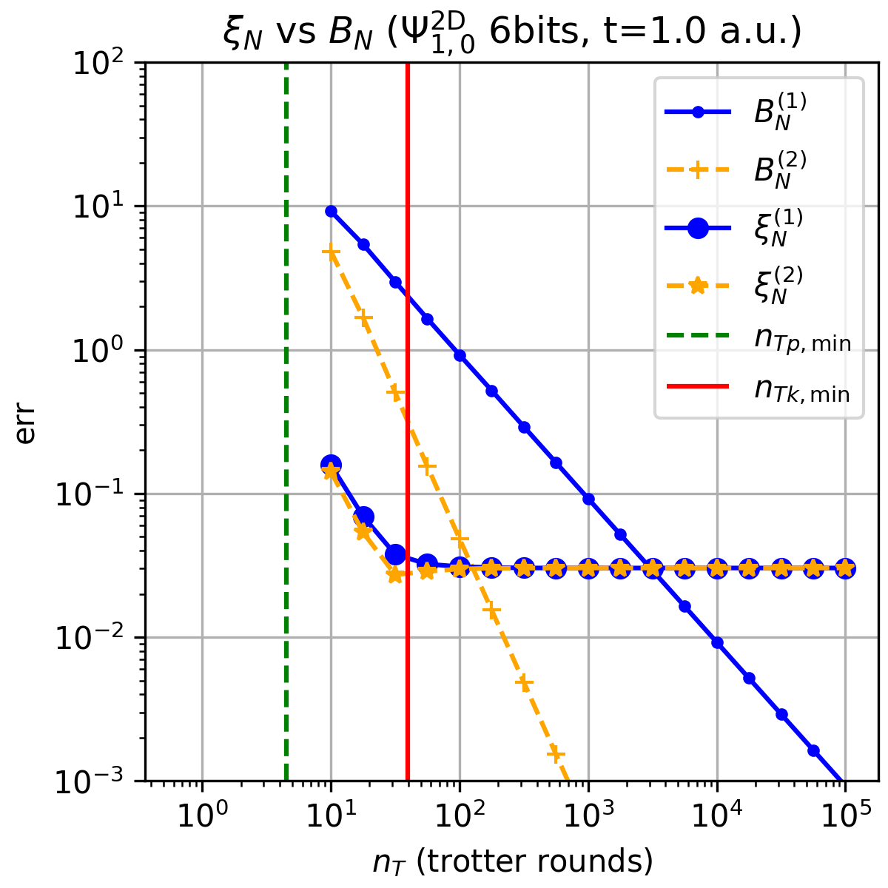
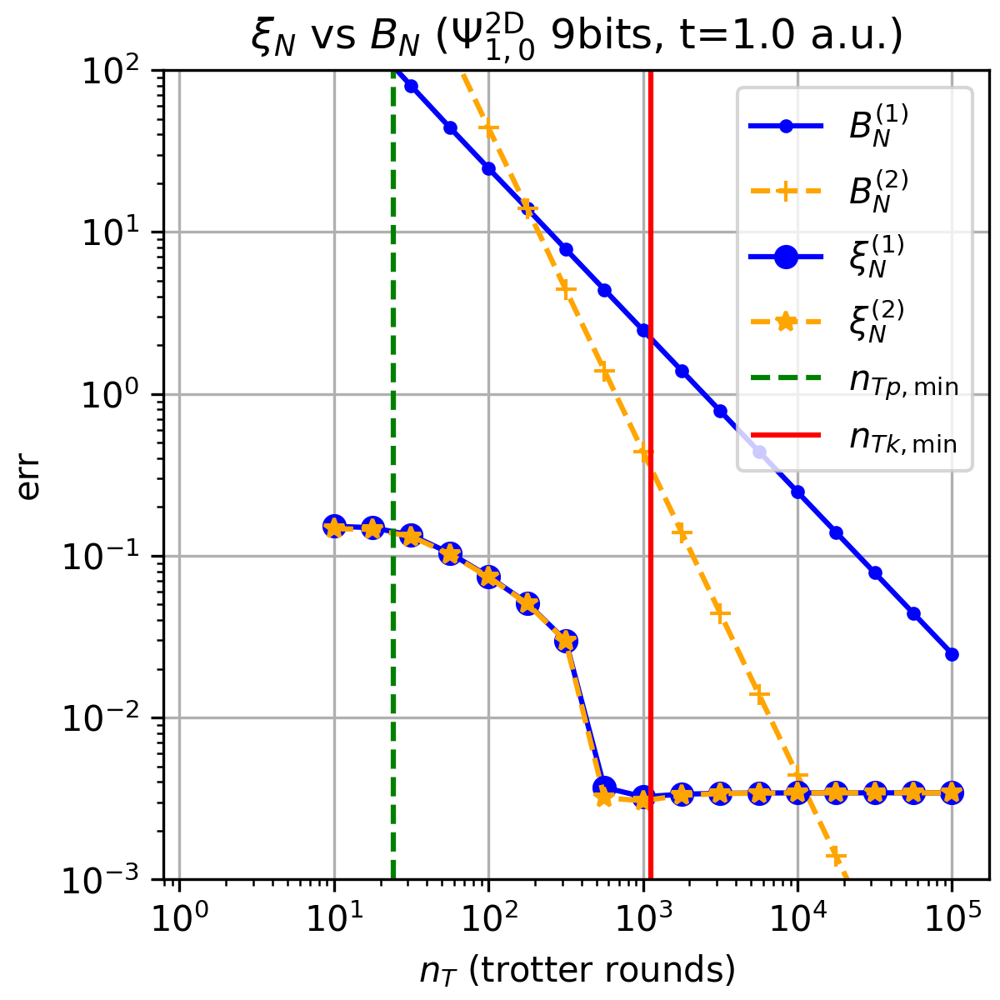
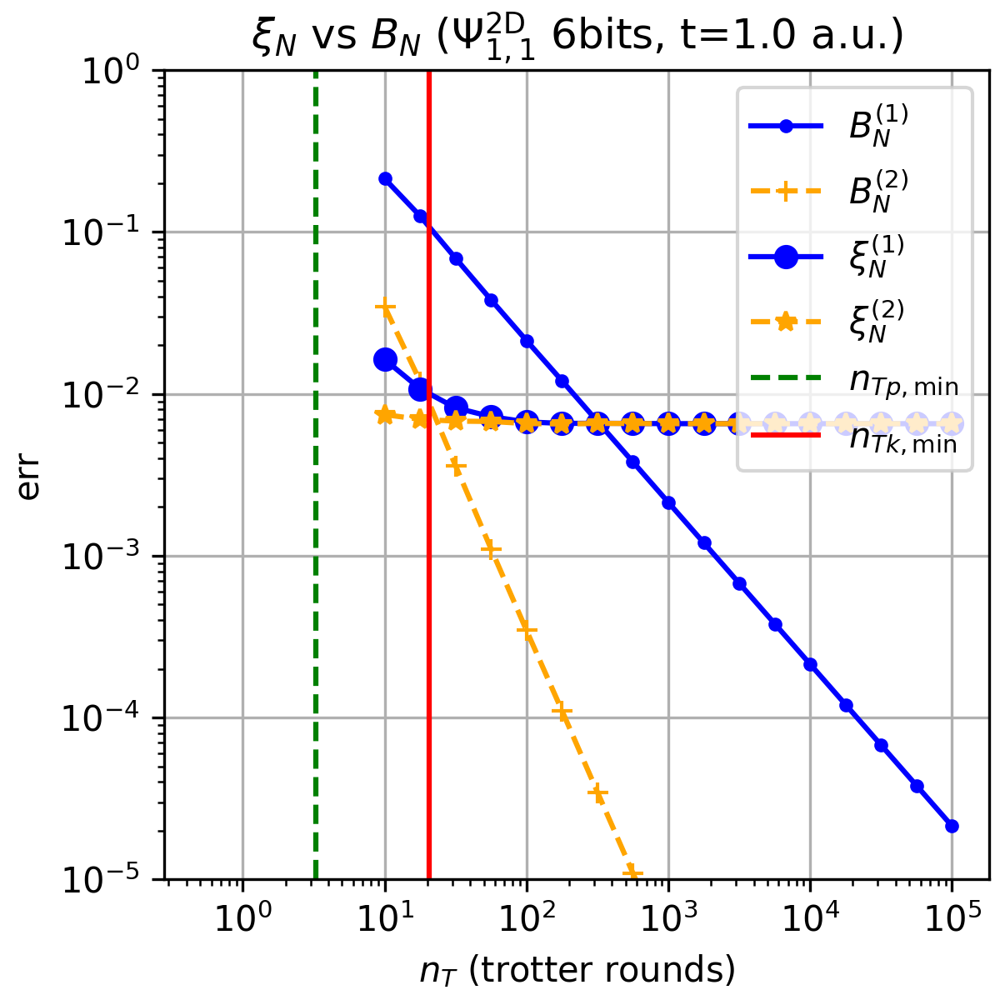
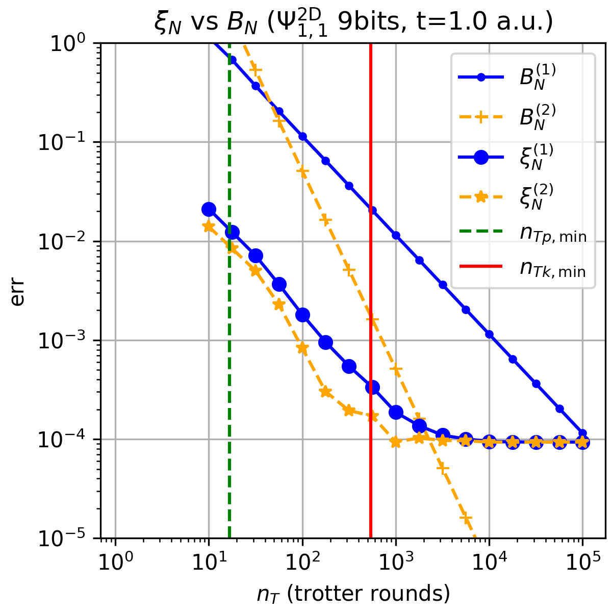

Data

- [Data for n=0, m=0, nb=6](parameters/evaluator/graphs/t30/trotter_err_n0_m0_6b_t30.csv)
- [Data for n=0, m=0, nb=9](parameters/evaluator/graphs/t30/trotter_err_n0_m0_9b_t30.csv)
- [Data for n=1, m=0, nb=6](parameters/evaluator/graphs/t30/trotter_err_n1_m0_6b_t30.csv)
- [Data for n=1, m=0, nb=9](parameters/evaluator/graphs/t30/trotter_err_n1_m0_9b_t30.csv)
- [Data for n=1, m=1, nb=6](parameters/evaluator/graphs/t30/trotter_err_n1_m1_6b_t30.csv)
- [Data for n=1, m=1, nb=9](parameters/evaluator/graphs/t30/trotter_err_n1_m1_9b_t30.csv)

Scripts to generate the data and the images

```bash
python sdt_error_series_00_t30.py
python sdt_error_series_10_t30.py
python sdt_error_series_11_t30.py
```

## Appendix B.
### Figure 15. Changes in energy values when varying $r_{\mathrm{eff}}$ in the approximated formula $H_{\mathrm{LA}}(r)$ for the 3D hydrogen atom model

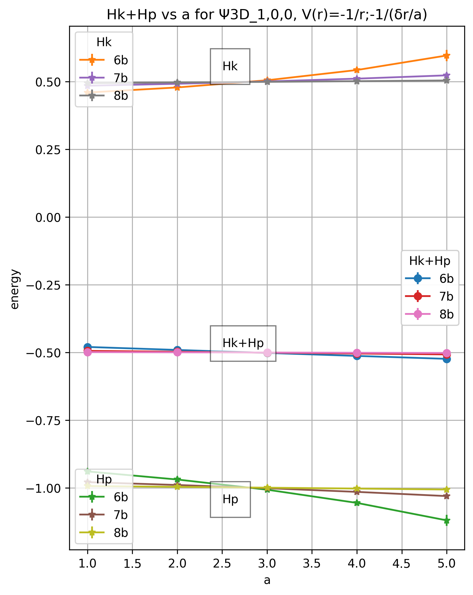

Data
- Local Average potential $H_{\mathrm{LA}}$ with $\Psi^{\mathrm{3D}}_{0,0}$
  - data for nb = 6
    - [a=1](classic3D/n1_l0_m0_TO2_r0lim_1.000/6b_L12.0_T12.6_iT0.2_dt0.005/energy_trace.csv)
    - [a=2](classic3D/n1_l0_m0_TO2_r0lim_0.500/6b_L12.0_T12.6_iT0.2_dt0.005/energy_trace.csv)
    - [a=3](classic3D/n1_l0_m0_TO2_r0lim_0.333/6b_L12.0_T12.6_iT0.2_dt0.005/energy_trace.csv)
    - [a=4](classic3D/n1_l0_m0_TO2_r0lim_0.250/6b_L12.0_T12.6_iT0.2_dt0.005/energy_trace.csv)
    - [a=5](classic3D/n1_l0_m0_TO2_r0lim_0.200/6b_L12.0_T12.6_iT0.2_dt0.005/energy_trace.csv)
  - data for nb = 7
    - [a=1](classic3D/n1_l0_m0_TO2_r0lim_1.000/7b_L13.0_T12.6_iT0.2_dt0.001/energy_trace.csv)
    - [a=2](classic3D/n1_l0_m0_TO2_r0lim_0.500/7b_L13.0_T12.6_iT0.2_dt0.001/energy_trace.csv)
    - [a=3](classic3D/n1_l0_m0_TO2_r0lim_0.333/7b_L13.0_T12.6_iT0.2_dt0.001/energy_trace.csv)
    - [a=4](classic3D/n1_l0_m0_TO2_r0lim_0.250/7b_L13.0_T12.6_iT0.2_dt0.001/energy_trace.csv)
    - [a=5](classic3D/n1_l0_m0_TO2_r0lim_0.200/7b_L13.0_T12.6_iT0.2_dt0.001/energy_trace.csv)
  - data for nb = 8
    - [a=1](classic3D/n1_l0_m0_TO2_r0lim_1.000/8b_L13.0_T12.6_iT0.2_dt0.0005/energy_trace.csv)
    - [a=2](classic3D/n1_l0_m0_TO2_r0lim_0.500/8b_L13.0_T12.6_iT0.2_dt0.0005/energy_trace.csv)
    - [a=3](classic3D/n1_l0_m0_TO2_r0lim_0.333/8b_L13.0_T12.6_iT0.2_dt0.0005/energy_trace.csv)
    - [a=4](classic3D/n1_l0_m0_TO2_r0lim_0.250/8b_L13.0_T12.6_iT0.2_dt0.0005/energy_trace.csv)
    - [a=5](classic3D/n1_l0_m0_TO2_r0lim_0.200/8b_L13.0_T12.6_iT0.2_dt0.0005/energy_trace.csv)

Scripts

To generate the time evolution data files (analytical and time evolution by classical code)

```bash
./run_evo_analytical_3Dh1_1_0_0.sh
./run_evo_classic_3Dh1_1_0_0.sh
```

To generate the energy comparison data files

```bash
./run_compare_energy_h3D.sh
```

To draw the images from the energy comparison data files

```bash
python compare_energy_h3D_r0.py
```

## Appendix C.
### Figure 16. The upper bound $B_N^{(\gamma)}$ and observed value $\xi_N^{(\gamma)}$ of the error with respect to the number of divisions $n_{\mathrm{T}}$ at the time evolution period $t=30.0$

Images

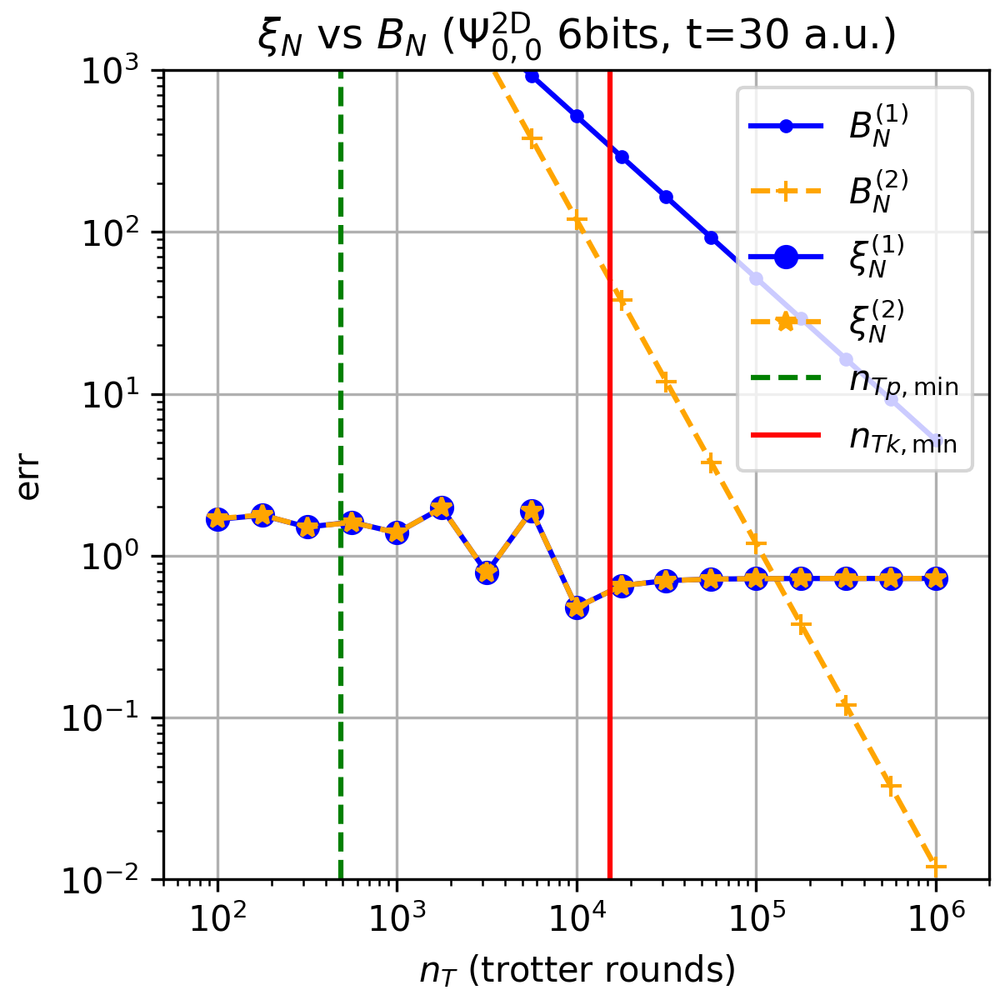
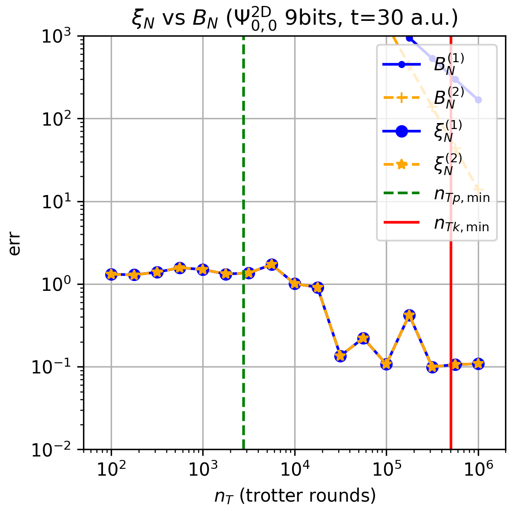
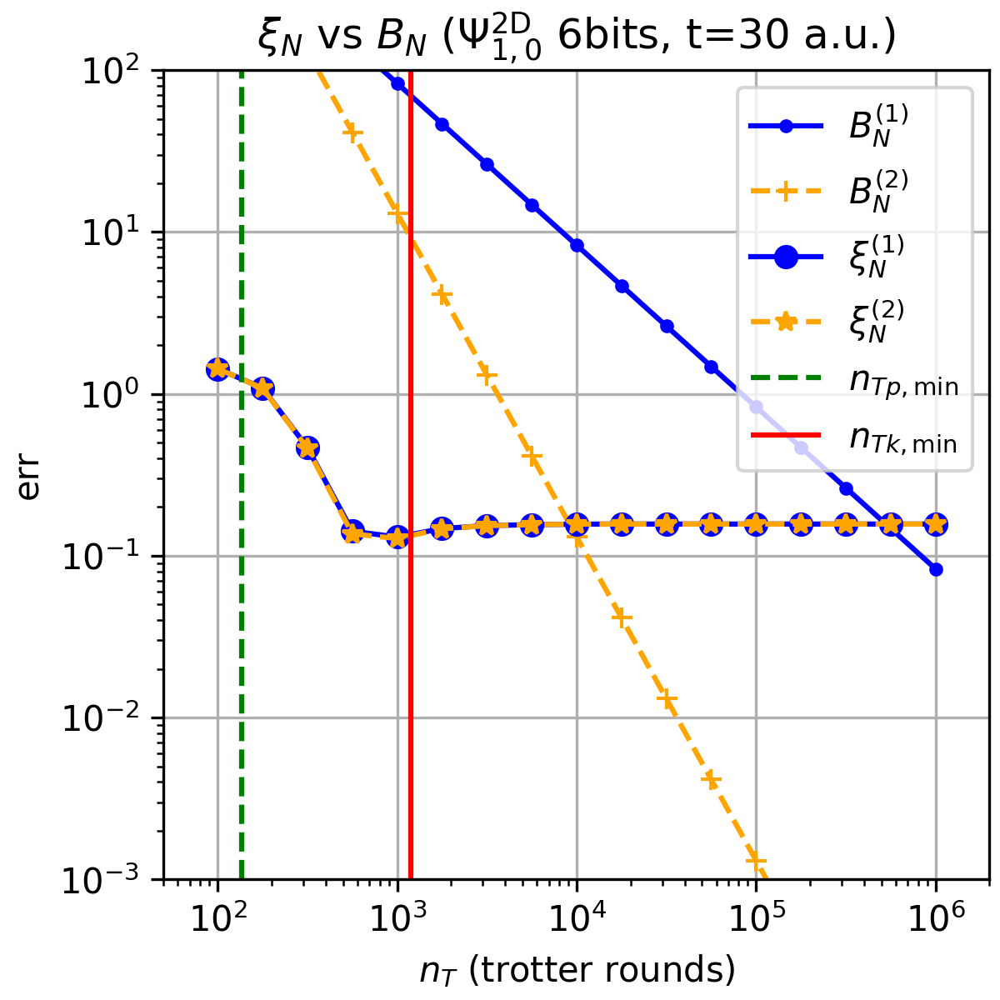
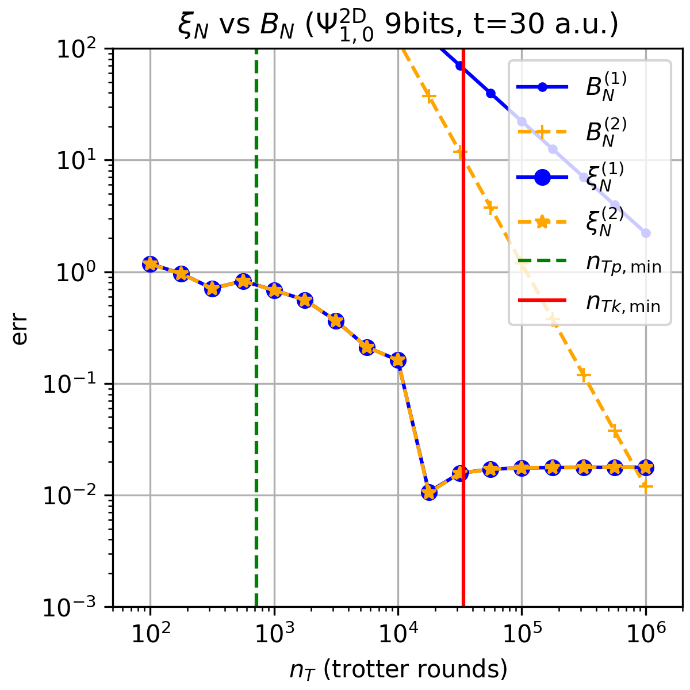
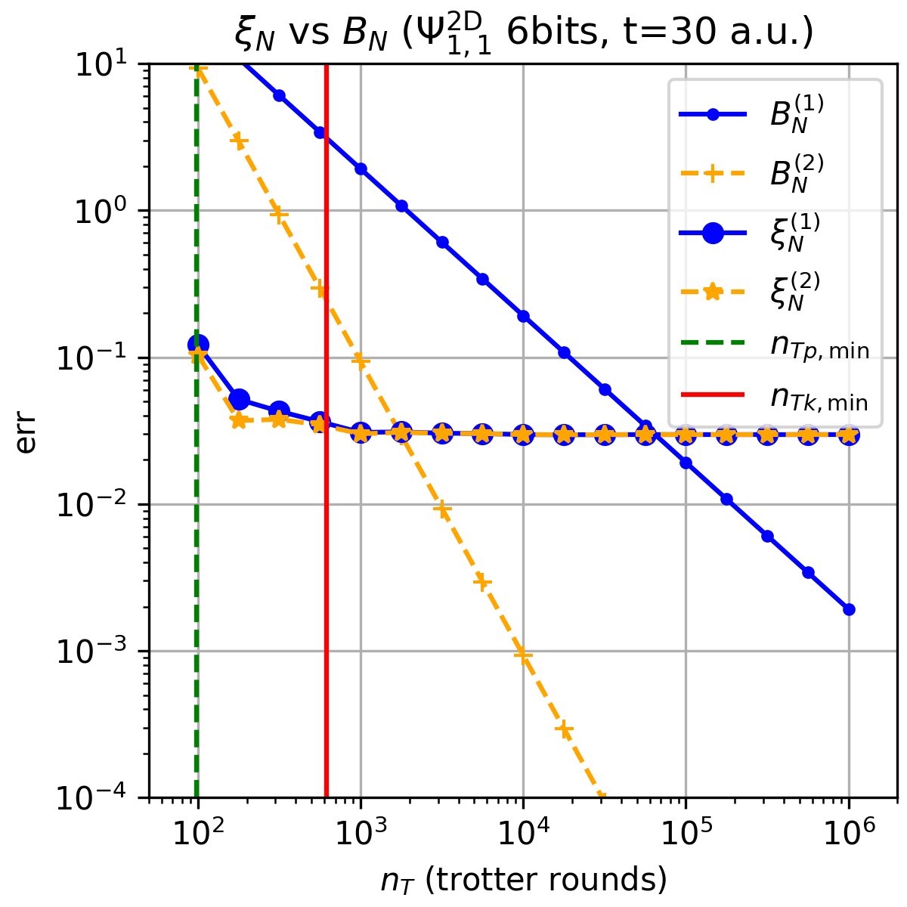
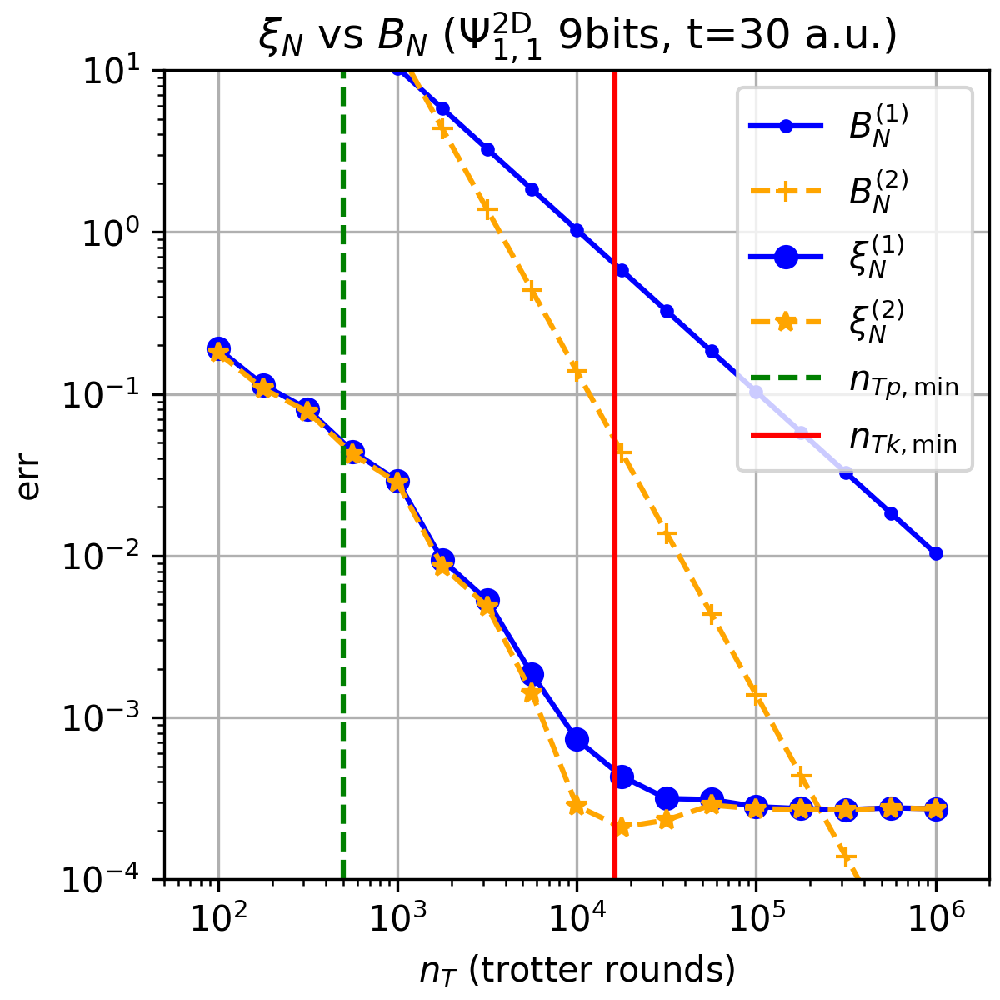

Data

- [Data for n=0, m=0, nb=6](parameters/evaluator/graphs/t1.0/trotter_err_n0_m0_6b_t1.0.csv)
- [Data for n=0, m=0, nb=9](parameters/evaluator/graphs/t1.0/trotter_err_n0_m0_9b_t1.0.csv)
- [Data for n=1, m=0, nb=6](parameters/evaluator/graphs/t1.0/trotter_err_n1_m0_6b_t1.0.csv)
- [Data for n=1, m=0, nb=9](parameters/evaluator/graphs/t1.0/trotter_err_n1_m0_9b_t1.0.csv)
- [Data for n=1, m=1, nb=6](parameters/evaluator/graphs/t1.0/trotter_err_n1_m1_6b_t1.0.csv)
- [Data for n=1, m=1, nb=9](parameters/evaluator/graphs/t1.0/trotter_err_n1_m1_9b_t1.0.csv)

Scripts to generate the data and the images

```bash
python sdt_error_series_00_t1.py
python sdt_error_series_10_t1.py
python sdt_error_series_11_t1.py
```
